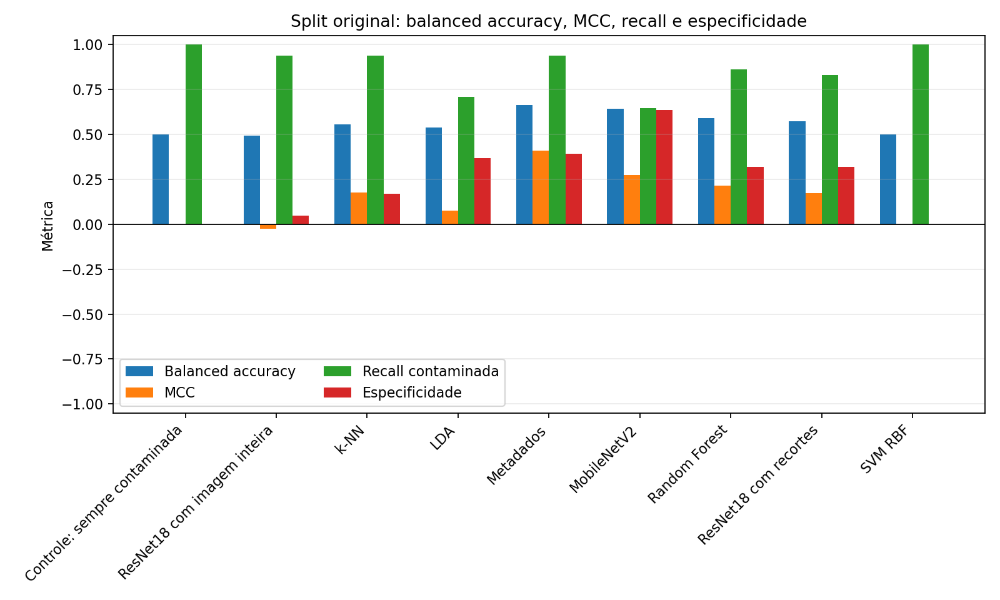
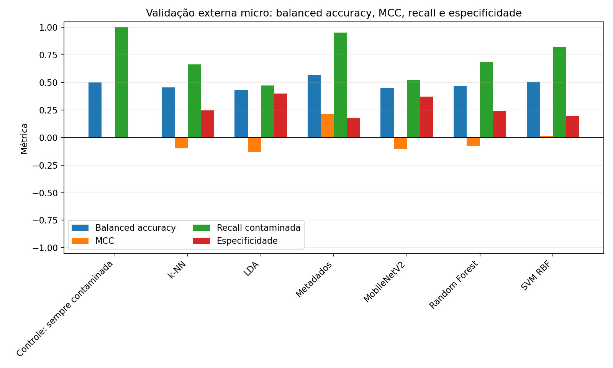
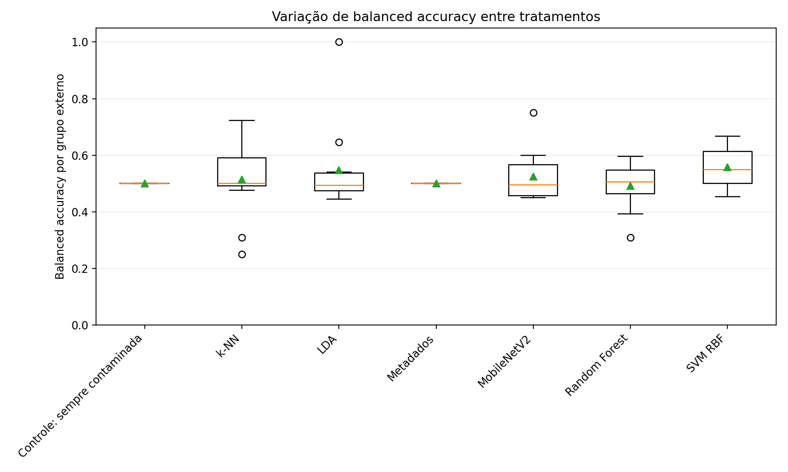
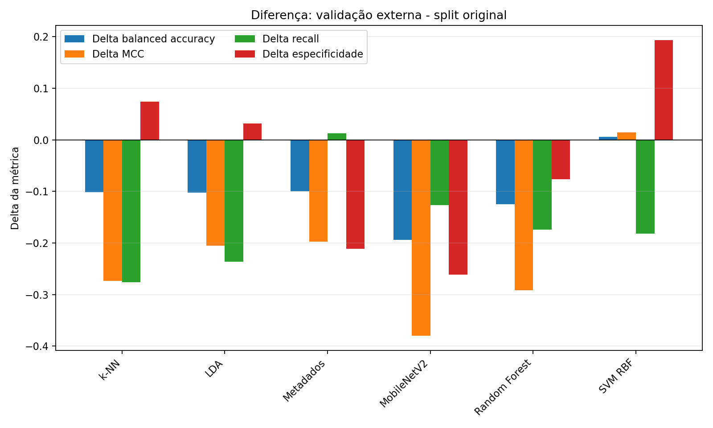

# Relatório científico final da classificação

Gerado em: 2026-06-08T15:25:29

## 1. Objetivo da classificação

O objetivo da classificação é estimar, a partir de imagens iniciais e
experimentos associados, o risco de contaminação posterior em sementes de
macaúba. A classe positiva é `contaminada`. A interpretação científica não deve
ser de detecção visual direta de infecção, mas de predição de risco associada ao
resultado observado posteriormente.

## 2. Amostras e grupos experimentais

A validação externa foi configurada para 703 amostras e
12 grupos `experimento_tratamento`. Esse grupo combina
`experimento_rotulo` e `tratamento_planilha` normalizados, reduzindo o risco de
que amostras do mesmo contexto experimental apareçam simultaneamente em treino
e teste externo.

Menor grupo externo:

| fold | grupo_externo | n_teste | teste_contaminada | teste_nao_contaminada |
| --- | --- | --- | --- | --- |
| 9 | teste_2__t4 | 3 | 2 | 1 |

Maior grupo externo:

| fold | grupo_externo | n_teste | teste_contaminada | teste_nao_contaminada |
| --- | --- | --- | --- | --- |
| 1 | micro_ondas__controle | 115 | 52 | 63 |

## 3. Protocolo do split original

O split original usa a divisão treino/validação/teste consolidada em
`saidas/tabelas/04_dataset_split/divisao_treino_validacao_teste.csv`. Os
modelos e thresholds do split original foram gerados em etapas anteriores; este
script apenas lê `comparacao_final_classificacao.csv` e não recalcula
thresholds.

## 4. Protocolo leave-one-experimento-tratamento-out

Na validação externa, cada grupo `experimento_tratamento` é deixado de fora uma
vez como teste externo. A validação interna usa um grupo inteiro do conjunto de
desenvolvimento, escolhido deterministicamente. O split original permanece
apenas como coluna de auditoria.

## 5. Modelos avaliados

Foram consolidados modelos de imagem inteira, YOLO/caixas, ResNet18 com
recortes, Random Forest, SVM RBF, k-NN e LDA com atributos visuais
normalizados, MobileNetV2 com recortes, baseline de metadados e baseline
sempre-contaminada. O baseline de
metadados é tratado como diagnóstico de viés de lote/tratamento, não como
candidato visual para aplicativo. O baseline sempre-contaminada é um controle,
não um modelo operacional.

Modelos concluídos na validação externa: Controle: sempre contaminada, k-NN, LDA, Metadados, MobileNetV2, Random Forest, SVM RBF.

## 6. Parâmetros científicos principais

```json
{
  "random_forest": {
    "grid_igual_script_23": true,
    "cv": "StratifiedGroupKFold",
    "cv_folds_tentativa": [
      5,
      4,
      3,
      2
    ],
    "n_jobs_grid": 6,
    "n_jobs_random_forest": 1
  },
  "svm_rbf": {
    "grid_igual_script_23": true,
    "pipeline": "SimpleImputer + StandardScaler + SVC RBF",
    "class_weight": "balanced"
  },
  "knn": {
    "grid_igual_script_23": true,
    "pipeline": "SimpleImputer + StandardScaler + KNeighborsClassifier",
    "n_neighbors": [
      3,
      5,
      7,
      9,
      11,
      15,
      21,
      31
    ],
    "n_neighbors_filtrado_por_menor_treino_cv": true,
    "weights": [
      "uniform",
      "distance"
    ],
    "p": [
      1,
      2
    ],
    "algorithm": "auto"
  },
  "lda": {
    "grid_igual_script_23": true,
    "pipeline": "SimpleImputer + StandardScaler + LinearDiscriminantAnalysis",
    "svd": {
      "tol": [
        0.0001,
        0.001,
        0.01
      ]
    },
    "lsqr": {
      "shrinkage": [
        null,
        "auto",
        0.01,
        0.1,
        0.5,
        0.9
      ]
    },
    "eigen": false
  },
  "metadados": {
    "logica_base": "script_26_taxas_suavizadas",
    "alpha_suavizacao": 10.0,
    "papel_experimento": "diagnostico_vies",
    "fit_apply_por_fold": true
  },
  "mobilenetv2": {
    "pesos_pre_treinados": "MobileNet_V2_Weights.DEFAULT",
    "pesos_imagenet_carregados": true,
    "entrada": "224x224",
    "batch_size": 8,
    "num_workers": 4,
    "mixed_precision": true,
    "pin_memory": true,
    "persistent_workers": true,
    "epochs_total": 80,
    "epochs_backbone_congelado": 5,
    "paciencia_early_stopping": 8,
    "learning_rate_classificador": 0.0001,
    "learning_rate_ajuste_fino": 1e-05,
    "weight_decay": 0.0001,
    "blocos_finais_descongelados": 4,
    "cudnn_benchmark": false,
    "cudnn_deterministic": true
  },
  "thresholds": {
    "fixo": 0.5,
    "melhor_f1": "selecionado somente na validacao interna",
    "prioridade_recall": "recall >= 0.95, maior F1, maior especificidade"
  }
}
```

## 7. Resultados do split original

Melhor modelo visual no split original com `threshold=0,50`:

MobileNetV2 | cenário=teste_threshold_0_50 | features=nao_aplicavel | balanced_accuracy=0.640 | MCC=0.274 | recall=0.646 | especificidade=0.634 | F1=0.689

O baseline de metadados pode aparecer acima de modelos visuais no split original,
mas essa linha é diagnóstica: ela indica que origem, tratamento, pasta e campos
derivados carregam informação sobre o lote/tratamento. Ela não é candidata ao
aplicativo.

Tabela resumida do split original no cenário `teste_threshold_0_50` e controle:

| modelo | cenario | conjunto_features | balanced_accuracy | mcc | recall_contaminada | especificidade_nao_contaminada | f1_contaminada |
| --- | --- | --- | --- | --- | --- | --- | --- |
| metadados_taxas_suavizadas | teste_threshold_0_50 | nao_aplicavel | 0.664 | 0.409 | 0.938 | 0.390 | 0.808 |
| mobilenetv2_recortes | teste_threshold_0_50 | nao_aplicavel | 0.640 | 0.274 | 0.646 | 0.634 | 0.689 |
| random_forest | teste_threshold_0_50 | principal_normalizado | 0.589 | 0.214 | 0.862 | 0.317 | 0.752 |
| recortes_resnet18 | teste_threshold_0_50 | nao_aplicavel | 0.574 | 0.172 | 0.831 | 0.317 | 0.735 |
| knn | teste_threshold_0_50 | principal_normalizado | 0.555 | 0.174 | 0.938 | 0.171 | 0.762 |
| lda | teste_threshold_0_50 | principal_normalizado | 0.537 | 0.077 | 0.708 | 0.366 | 0.672 |
| svm_rbf | teste_threshold_0_50 | principal_normalizado | 0.500 | 0.000 | 1.000 | 0.000 | 0.760 |
| baseline_sempre_contaminada | teste_baseline_sempre_contaminada | nao_aplicavel | 0.500 | 0.000 | 1.000 | 0.000 | 0.760 |
| baseline_resnet18_imagem_inteira | teste_threshold_0_50 | nao_aplicavel | 0.494 | -0.027 | 0.938 | 0.049 | 0.739 |

## 8. Resultados externos micro e macro

Na agregação micro, as matrizes de confusão dos folds são somadas antes do
cálculo das métricas. Ela pesa mais os grupos com mais amostras. Na agregação
macro, as métricas são calculadas por grupo externo e depois resumidas por média
e desvio-padrão. Essa leitura mostra variação entre tratamentos, mas fica
instável quando há grupos pequenos.

Melhor modelo visual na validação externa:

Random Forest | cenário=teste_threshold_melhor_f1_validacao | features=principal_normalizado | balanced_accuracy=0.523 | MCC=0.061 | recall=0.853 | especificidade=0.193 | F1=0.720

Resumo micro:

| modelo | cenario | conjunto_features | balanced_accuracy | mcc | recall_contaminada | especificidade_nao_contaminada | f1_contaminada | folds |
| --- | --- | --- | --- | --- | --- | --- | --- | --- |
| metadados_taxas_suavizadas | teste_threshold_0_50 | nao_aplicavel | 0.565 | 0.212 | 0.951 | 0.179 | 0.768 | 12 |
| random_forest | teste_threshold_melhor_f1_validacao | principal_normalizado | 0.523 | 0.061 | 0.853 | 0.193 | 0.720 | 12 |
| random_forest | teste_threshold_prioridade_recall_validacao | principal_normalizado | 0.523 | 0.061 | 0.853 | 0.193 | 0.720 | 12 |
| knn | teste_threshold_melhor_f1_validacao | principal_normalizado | 0.519 | 0.108 | 0.984 | 0.055 | 0.760 | 12 |
| knn | teste_threshold_prioridade_recall_validacao | principal_normalizado | 0.519 | 0.108 | 0.984 | 0.055 | 0.760 | 12 |
| svm_rbf | teste_threshold_0_50 | principal_normalizado | 0.506 | 0.015 | 0.818 | 0.193 | 0.701 | 12 |
| baseline_sempre_contaminada | teste_baseline_sempre_contaminada | nao_aplicavel | 0.500 | 0.000 | 1.000 | 0.000 | 0.758 | 12 |
| metadados_taxas_suavizadas | teste_threshold_melhor_f1_validacao | nao_aplicavel | 0.500 | 0.000 | 1.000 | 0.000 | 0.758 | 12 |
| metadados_taxas_suavizadas | teste_threshold_prioridade_recall_validacao | nao_aplicavel | 0.500 | 0.000 | 1.000 | 0.000 | 0.758 | 12 |
| svm_rbf | teste_threshold_melhor_f1_validacao | principal_normalizado | 0.500 | 0.000 | 1.000 | 0.000 | 0.758 | 12 |
| svm_rbf | teste_threshold_prioridade_recall_validacao | principal_normalizado | 0.500 | 0.000 | 1.000 | 0.000 | 0.758 | 12 |
| mobilenetv2_recortes | teste_threshold_melhor_f1_validacao | nao_aplicavel | 0.500 | -0.001 | 0.897 | 0.102 | 0.726 | 12 |

Resumo macro:

| modelo | cenario | conjunto_features | balanced_accuracy_media | balanced_accuracy_dp | mcc_media | mcc_dp | recall_contaminada_media | especificidade_nao_contaminada_media | folds |
| --- | --- | --- | --- | --- | --- | --- | --- | --- | --- |
| svm_rbf | teste_threshold_0_50 | principal_normalizado | 0.558 | 0.072 | 0.110 | 0.131 | 0.869 | 0.247 | 12 |
| lda | teste_threshold_0_50 | principal_normalizado | 0.547 | 0.152 | 0.112 | 0.306 | 0.565 | 0.530 | 12 |
| mobilenetv2_recortes | teste_threshold_0_50 | nao_aplicavel | 0.524 | 0.089 | 0.048 | 0.178 | 0.486 | 0.562 | 12 |
| knn | teste_threshold_melhor_f1_validacao | principal_normalizado | 0.523 | 0.049 | 0.049 | 0.116 | 0.955 | 0.091 | 12 |
| knn | teste_threshold_prioridade_recall_validacao | principal_normalizado | 0.523 | 0.049 | 0.049 | 0.116 | 0.955 | 0.091 | 12 |
| knn | teste_threshold_0_50 | principal_normalizado | 0.514 | 0.138 | -0.001 | 0.235 | 0.661 | 0.366 | 12 |
| random_forest | teste_threshold_melhor_f1_validacao | principal_normalizado | 0.510 | 0.067 | 0.022 | 0.128 | 0.872 | 0.149 | 12 |
| random_forest | teste_threshold_prioridade_recall_validacao | principal_normalizado | 0.510 | 0.067 | 0.022 | 0.128 | 0.872 | 0.149 | 12 |
| baseline_sempre_contaminada | teste_baseline_sempre_contaminada | nao_aplicavel | 0.500 | 0.000 | 0.000 | 0.000 | 1.000 | 0.000 | 12 |
| metadados_taxas_suavizadas | teste_threshold_0_50 | nao_aplicavel | 0.500 | 0.000 | 0.000 | 0.000 | 0.708 | 0.292 | 12 |
| metadados_taxas_suavizadas | teste_threshold_melhor_f1_validacao | nao_aplicavel | 0.500 | 0.000 | 0.000 | 0.000 | 1.000 | 0.000 | 12 |
| metadados_taxas_suavizadas | teste_threshold_prioridade_recall_validacao | nao_aplicavel | 0.500 | 0.000 | 0.000 | 0.000 | 1.000 | 0.000 | 12 |

## 9. Comparação com baseline sempre-contaminada

O baseline sempre-contaminada é um controle obrigatório: ele tende a maximizar
recall da classe contaminada ao custo de especificidade nula ou muito baixa.
Resultados com F1 alto devem ser interpretados contra esse controle.

Split original:

| cenario | balanced_accuracy | mcc | recall_contaminada | especificidade_nao_contaminada | f1_contaminada |
| --- | --- | --- | --- | --- | --- |
| teste_baseline_sempre_contaminada | 0.500 | 0.000 | 1.000 | 0.000 | 0.760 |

Validação externa:

| agregacao | cenario | balanced_accuracy | mcc | recall_contaminada | especificidade_nao_contaminada | f1_contaminada | balanced_accuracy_media | mcc_media |
| --- | --- | --- | --- | --- | --- | --- | --- | --- |
| micro | teste_baseline_sempre_contaminada | 0.500 | 0.000 | 1.000 | 0.000 | 0.758 | NA | NA |
| macro | teste_baseline_sempre_contaminada | NA | NA | NA | NA | NA | 0.500 | 0.000 |

## 10. Diagnóstico de viés de lote/tratamento

O baseline de metadados usa origem, tratamento, pasta e campos derivados. Ele
serve para diagnosticar viés de lote/tratamento e não deve ser tratado como
modelo visual candidato ao aplicativo. Portanto, não há declaração de vencedor
baseada nos metadados, mesmo quando suas métricas superam as de modelos visuais.

Split original metadados:

| cenario | balanced_accuracy | mcc | recall_contaminada | especificidade_nao_contaminada | f1_contaminada |
| --- | --- | --- | --- | --- | --- |
| teste_threshold_0_50 | 0.664 | 0.409 | 0.938 | 0.390 | 0.808 |
| teste_threshold_melhor_f1_validacao | 0.664 | 0.409 | 0.938 | 0.390 | 0.808 |
| teste_threshold_prioridade_recall_validacao | 0.570 | 0.245 | 0.969 | 0.171 | 0.778 |

Validação externa metadados:

| agregacao | cenario | balanced_accuracy | mcc | recall_contaminada | especificidade_nao_contaminada | f1_contaminada | balanced_accuracy_media | mcc_media |
| --- | --- | --- | --- | --- | --- | --- | --- | --- |
| micro | teste_threshold_0_50 | 0.565 | 0.212 | 0.951 | 0.179 | 0.768 | NA | NA |
| macro | teste_threshold_0_50 | NA | NA | NA | NA | NA | 0.500 | 0.000 |
| micro | teste_threshold_melhor_f1_validacao | 0.500 | 0.000 | 1.000 | 0.000 | 0.758 | NA | NA |
| macro | teste_threshold_melhor_f1_validacao | NA | NA | NA | NA | NA | 0.500 | 0.000 |
| micro | teste_threshold_prioridade_recall_validacao | 0.500 | 0.000 | 1.000 | 0.000 | 0.758 | NA | NA |
| macro | teste_threshold_prioridade_recall_validacao | NA | NA | NA | NA | NA | 0.500 | 0.000 |

## 11. Limitações

As conclusões são limitadas pelo tamanho da base, pelo número de grupos
experimentais e por possíveis diferenças técnicas entre lotes, tratamentos,
origens e padrões de imagem. Grupos pequenos reduzem a estabilidade das métricas
por tratamento e tornam as médias macro mais instáveis, porque cada grupo
externo recebe o mesmo peso independentemente da quantidade de amostras.

Grupos pequenos no diagnóstico dos folds:

| fold | grupo_externo | n_teste | teste_contaminada | teste_nao_contaminada |
| --- | --- | --- | --- | --- |
| 9 | teste_2__t4 | 3 | 2 | 1 |

## 12. Conclusão sobre viabilidade da classificação

Não se deve declarar vencedor apenas por F1. A leitura prioritária combina
balanced accuracy, MCC, recall da classe contaminada e especificidade da classe
não contaminada.

No split original, o melhor modelo visual foi o MobileNetV2 com recortes no
`threshold=0,50`, com balanced accuracy 0.640
e MCC 0.274. Na validação externa com o mesmo threshold, o
MobileNetV2 caiu para balanced accuracy
0.446 e MCC -0.106. O
Random Forest externo com threshold validado obteve balanced accuracy
0.523 e MCC 0.061.

Esses resultados indicam de forma afirmativa que nenhum modelo visual
generalizou de forma suficiente para classificação automática direta em
tratamentos desconhecidos. O desempenho externo fica próximo de um sinal fraco:
MCC negativo para MobileNetV2 no threshold fixo e MCC baixo para Random Forest
com threshold validado. A conclusão operacional é que a classificação direta
automática ainda não é viável como decisão final em lotes/tratamentos não
vistos.

## 13. Justificativa para avançar para triagem preventiva

A classificação direta exige boa sensibilidade sem destruir a especificidade. O
histórico dos experimentos mostra que recall alto pode ser obtido por regras
conservadoras próximas ao baseline sempre-contaminada. Portanto, a etapa
operacional mais defensável é triagem preventiva: separar alto risco, revisar
casos incertos e evitar liberação automática de baixo risco sem validação
adicional por lote/tratamento.

## Figuras






## Arquivos derivados deste relatório

- `saidas\tabelas\07_classificacao_final\relatorio\tabela_resultados_split_original.csv`
- `saidas\tabelas\07_classificacao_final\relatorio\tabela_resultados_validacao_externa.csv`
- `saidas\tabelas\07_classificacao_final\relatorio\tabela_desempenho_por_tratamento.csv`
- `saidas\tabelas\07_classificacao_final\relatorio\manifesto_experimento_final.json`
