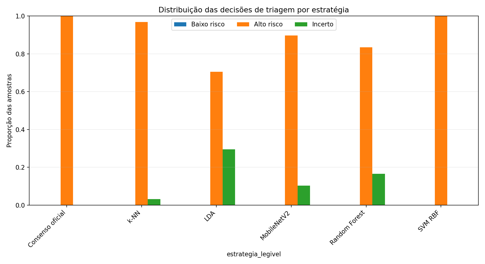
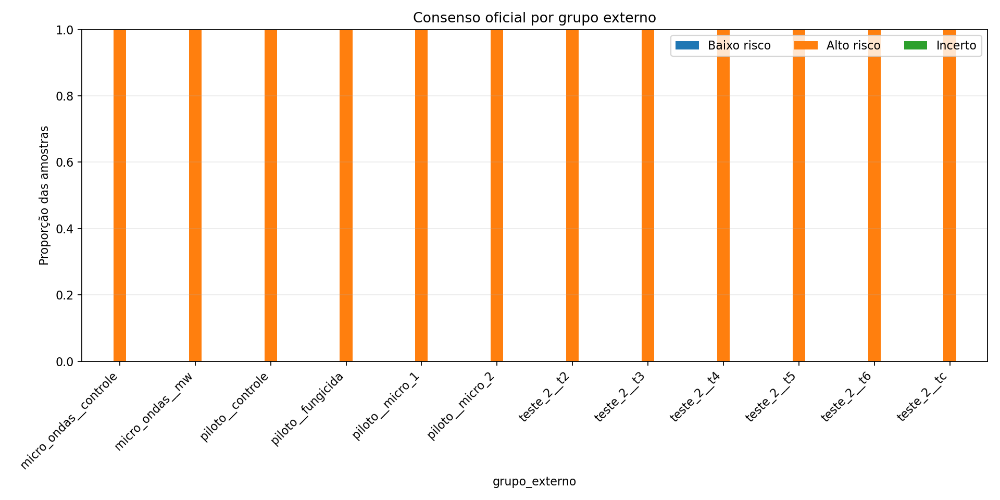

# Relatório da triagem preventiva

Gerado em: 2026-06-08T15:45:47

## 1. Objetivo

A triagem preventiva transforma os resultados de classificação em uma regra
operacional conservadora. Ela não substitui a avaliação manual: o objetivo é
priorizar alto risco, manter incerteza quando o sinal não é suficiente e evitar
tratar baixo risco como liberação automática.

## 2. Entradas

- `saidas\tabelas\08_triagem\tabela_integrada_triagem.csv`
- `saidas\tabelas\08_triagem\scores_candidatos_triagem.csv`
- `saidas\tabelas\08_triagem\thresholds_crossfit_por_grupo.csv`
- `saidas\tabelas\08_triagem\predicoes_triagem_crossfit.csv`
- `saidas\tabelas\08_triagem\metricas_triagem_por_grupo.csv`
- `saidas\tabelas\08_triagem\resumo_triagem_micro_macro.csv`
- `saidas\tabelas\08_triagem\score_triagem_recomendado.csv`

## 3. Estratégia oficial

A estratégia oficial foi definida antes da avaliação externa:
`consenso_pre_especificado`.

Regras:

- baixo risco: todos os modelos visuais completos abaixo dos seus thresholds
  baixos no fold;
- alto risco: pelo menos um modelo acima do seu threshold alto no fold;
- incerto: demais casos;
- se algum modelo/fold não tiver threshold baixo seguro, não há baixo risco
  naquele fold;
- a comparação externa de estratégias é exploratória e não seleciona a regra.

O termo `crossfit` permanece apenas nos nomes técnicos dos arquivos. Neste
relatório, ele significa validação externa
leave-one-experimento-tratamento-out com calibração interna por grupo; não deve
ser interpretado como cross-fitting estatístico clássico.

Invariantes registrados:

- `criterio_definido_antes_avaliacao = true`;
- `usa_resultado_externo_para_selecao = false`;
- `baixo_risco_nao_e_liberacao_automatica = true`.

## 4. Thresholds

Threshold baixo: maior threshold da validação interna com `fn == 0`,
`tn >= minimo_utilidade` e `threshold_baixo < threshold_alto`, em que
`minimo_utilidade = max(5, ceil(0.05 * suporte_nao_contaminada_validacao))`.

Threshold alto: melhor F1 da classe contaminada na validação interna,
desempatando por recall, precisão e menor número de falsos positivos.

Thresholds sem zona de baixo risco:

| fold | grupo externo | modelo | conjunto de features | status threshold baixo |
| --- | --- | --- | --- | --- |
| 1 | micro_ondas__controle | knn | principal_normalizado | baixo_risco_suspenso |
| 1 | micro_ondas__controle | lda | principal_normalizado | baixo_risco_suspenso |
| 1 | micro_ondas__controle | mobilenetv2_recortes | nao_aplicavel | baixo_risco_suspenso |
| 1 | micro_ondas__controle | random_forest | principal_normalizado | baixo_risco_suspenso |
| 1 | micro_ondas__controle | svm_rbf | principal_normalizado | baixo_risco_suspenso |
| 2 | micro_ondas__mw | knn | principal_normalizado | baixo_risco_suspenso |
| 2 | micro_ondas__mw | lda | principal_normalizado | baixo_risco_suspenso |
| 2 | micro_ondas__mw | mobilenetv2_recortes | nao_aplicavel | baixo_risco_suspenso |
| 2 | micro_ondas__mw | random_forest | principal_normalizado | baixo_risco_suspenso |
| 2 | micro_ondas__mw | svm_rbf | principal_normalizado | baixo_risco_suspenso |
| 3 | piloto__controle | knn | principal_normalizado | baixo_risco_suspenso |
| 3 | piloto__controle | lda | principal_normalizado | baixo_risco_suspenso |
| 3 | piloto__controle | mobilenetv2_recortes | nao_aplicavel | baixo_risco_suspenso |
| 3 | piloto__controle | random_forest | principal_normalizado | baixo_risco_suspenso |
| 3 | piloto__controle | svm_rbf | principal_normalizado | baixo_risco_suspenso |
| 4 | piloto__fungicida | knn | principal_normalizado | baixo_risco_suspenso |
| 4 | piloto__fungicida | lda | principal_normalizado | baixo_risco_suspenso |
| 4 | piloto__fungicida | mobilenetv2_recortes | nao_aplicavel | baixo_risco_suspenso |
| 4 | piloto__fungicida | random_forest | principal_normalizado | baixo_risco_suspenso |
| 4 | piloto__fungicida | svm_rbf | principal_normalizado | baixo_risco_suspenso |

## 5. Resultado oficial

| estratégia oficial | total | baixo risco | alto risco | incerto | contaminadas em baixo risco | taxa contaminada em baixo risco | recall alto risco | precisão alto risco | cobertura da decisão | viabilidade operacional | resultado científico |
| --- | --- | --- | --- | --- | --- | --- | --- | --- | --- | --- | --- |
| consenso_pre_especificado | 703 | 0 | 703 | 0 | 0 | 0.000 | 1.000 | 0.610 | 1.000 | 0.000 | triagem_nao_viavel_com_base_atual |

Resultado observado nos CSVs consolidados: o consenso oficial classificou
todas as 703 amostras como alto risco; houve 0 amostras incertas e
0 em baixo risco. Zona de baixo risco valida:
não. O recall de alto risco foi
1,000 e a precisão de alto risco foi
aproximadamente 0,610.

Com esse resultado, a regra oficial equivale operacionalmente a uma política de
cautela total. Ela preserva recall, mas não apresentou capacidade útil de
priorização, porque não criou zona de baixo risco válida nem reduziu o conjunto
encaminhado a alto risco. Viabilidade operacional:
false. Motivo registrado:
`consenso_classificou_todas_amostras_como_alto_risco`. Resultado científico: `triagem_nao_viavel_com_base_atual`.

## 6. Micro e macro

Agregação micro soma todas as amostras antes das métricas. Agregação macro
resume os grupos externos e é mais sensível a grupos pequenos.

Resumo micro:

| estratégia | tipo de estratégia | total | baixo risco | alto risco | incerto | contaminadas em baixo risco | recall alto risco | cobertura da decisão |
| --- | --- | --- | --- | --- | --- | --- | --- | --- |
| Consenso oficial | consenso_oficial | 703 | 0 | 703 | 0 | 0 | 1.000 | 1.000 |
| k-NN | individual_descritiva | 703 | 0 | 681 | 22 | 0 | 0.984 | 0.969 |
| LDA | individual_descritiva | 703 | 0 | 496 | 207 | 0 | 0.688 | 0.706 |
| MobileNetV2 | individual_descritiva | 703 | 0 | 631 | 72 | 0 | 0.897 | 0.898 |
| Random Forest | individual_descritiva | 703 | 0 | 587 | 116 | 0 | 0.853 | 0.835 |
| SVM RBF | individual_descritiva | 703 | 0 | 703 | 0 | 0 | 1.000 | 1.000 |

Resumo macro:

| estratégia | tipo de estratégia | grupos | taxa baixo risco média | taxa alto risco média | taxa incerto média | recall alto risco médio | cobertura da decisão média |
| --- | --- | --- | --- | --- | --- | --- | --- |
| Consenso oficial | consenso_oficial | 12 | 0.000 | 1.000 | 0.000 | 1.000 | 1.000 |
| k-NN | individual_descritiva | 12 | 0.000 | 0.927 | 0.073 | 0.955 | 0.927 |
| LDA | individual_descritiva | 12 | 0.000 | 0.693 | 0.307 | 0.684 | 0.693 |
| MobileNetV2 | individual_descritiva | 12 | 0.000 | 0.842 | 0.158 | 0.837 | 0.842 |
| Random Forest | individual_descritiva | 12 | 0.000 | 0.872 | 0.128 | 0.872 | 0.872 |
| SVM RBF | individual_descritiva | 12 | 0.000 | 1.000 | 0.000 | 1.000 | 1.000 |

## 7. Casos críticos

Contaminadas em baixo risco:

Sem dados disponíveis.

Todos os casos críticos ficam em `saidas\tabelas\08_triagem\casos_criticos_triagem.csv`.

## 8. Figuras

## 9. Manifestos

- `saidas\tabelas\08_triagem\manifesto_thresholds_triagem.json`
- `saidas\tabelas\08_triagem\manifesto_comparacao_triagem.json`

Campos principais:

| campo | valor |
| --- | --- |
| protocolo | triagem_preventiva_crossfit |
| abreviacao_crossfit | nome técnico interno dos arquivos; corresponde a validação externa leave-one-experimento-tratamento-out com calibração interna por grupo, não a cross-fitting estatístico clássico |
| estrategia_oficial | consenso_pre_especificado |
| criterio_definido_antes_avaliacao | true |
| usa_resultado_externo_para_selecao | false |
| formula_minimo_utilidade | max(5, ceil(0.05 * suporte_nao_contaminada_validacao)) |
| resultado_cientifico | triagem_nao_viavel_com_base_atual |

## 10. Conclusão

A triagem preventiva foi avaliada sem selecionar regra por desempenho externo.
O consenso pré-especificado permanece como estratégia oficial, e as estratégias
individuais continuam apenas como análises secundárias e descritivas; nenhuma
delas deve ser promovida a oficial depois de olhar a validação externa.

O resultado observado foi cautela total: todas as 703 amostras em alto risco,
0 incertas e 0 em baixo risco. Com a base atual,
a triagem automática não foi considerada operacionalmente viável.
